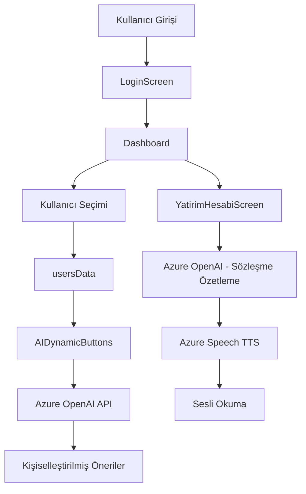

# 🏦 Engelsiz Bankacılık - Alternatif Bank AI Destekli Mobil Uygulama

[](https://reactnative.dev/)
[](https://expo.dev/)
[](https://azure.microsoft.com/en-us/products/ai-services/openai-service)
[](LICENSE)

**Engelsiz Bankacılık Hackathonu** kapsamında geliştirilmiş, engelli kullanıcılara yönelik **erişilebilirliğe odaklanan**, **Azure OpenAI API destekli yapay zeka** ile kişiselleştirilmiş bankacılık deneyimi sunan React Native mobil uygulaması.

---

## 📋 İçindekiler

- [Proje Hakkında](#-proje-hakkında)
- [Özellikler](#-özellikler)
- [Kullanılan Teknolojiler](#-kullanılan-teknolojiler)
- [Mimari Yapı](#-mimari-yapı)
- [Kurulum](#-kurulum)
- [Kullanım](#-kullanım)
- [Azure Servisleri Kurulumu](#-azure-servisleri-kurulumu)
- [Ekran Görüntüleri](#-ekran-görüntüleri)
- [Proje Yapısı](#-proje-yapısı)
- [Katkıda Bulunanlar](#-katkıda-bulunanlar)

---

## 🎯 Proje Hakkında

Bu proje, **Alternatif Bank** için engelli kullanıcılara yönelik erişilebilirliğe odaklanan, **Azure OpenAI API destekli yapay zeka** ile kişiselleştirilmiş bankacılık deneyimi sunan, **React Native** ve **Expo** tabanlı bir mobil bankacılık uygulamasıdır.

Uygulama, kullanıcı profil analizi ile **dinamik kısayol önerileri**, **Azure Speech Services** ile **sesli okuma özelliği**, karmaşık sözleşmelerin **AI destekli bilgilendirici metne dönüştürülmesi** ve **erişilebilirlik standartlarına** uygun tasarım özellikleri içermektedir.

---

## ✨ Özellikler

### 🤖 AI Destekli Özellikler

- **🎯 Dinamik Kısayol Önerileri**: Kullanıcı profil bilgilerine (meslek, işlem geçmişi, ev sahibi olma durumu, kredi kullanımı) göre Azure OpenAI GPT-4 ile kişiselleştirilmiş 4 bankacılık işlem önerisi
- **📄 Sözleşme Özetleme**: Karmaşık yasal metinlerin AI ile basitleştirilmesi ve anlaşılır hale getirilmesi (maksimum 8 satır özet)
- **🔊 Sesli Okuma**: Azure Speech Services (TTS) ile sözleşme ve bilgilendirici metinlerin Türkçe sesli okunması (tr-TR-EmelNeural voice)
- **📊 Akıllı Profil Analizi**: Kullanıcının son 30 işlem geçmişi ve demografik bilgilerine göre gerçek zamanlı öneri motoru

### ♿ Erişilebilirlik Özellikleri

- **Accessibility Labels**: WCAG 2.1 uyumlu tüm etkileşimli elementlerde erişilebilirlik etiketleri
- **Sesli Asistan Desteği**: Ekran okuyucu uyumluluğu
- **Yüksek Kontrast Tasarım**: Görme engelliler için optimize edilmiş renk paleti
- **Dokunmatik Geri Bildirim**: Haptik feedback desteği
- **Responsive Tasarım**: Farklı cihaz boyutlarına dinamik uyum

### 🏦 Bankacılık İşlemleri

- **💰 Para Gönderme**: Kendi hesapları arası, başka banka, QR kod, yurt dışı transfer
- **💳 Ödemeler**: Fatura ödeme, kart ödemesi, MTV, vergi ödemeleri
- **📈 Yatırım İşlemleri**: Yatırım hesabı açma, hisse senedi, fon işlemleri
- **📋 Başvurular**: Kredi, hesap, kart başvuruları
- **👥 Çoklu Kullanıcı Profili**: Farklı kullanıcı profilleri arasında geçiş

### 🎨 Kullanıcı Deneyimi

- **Modern UI/UX**: Alternatif Bank kurumsal kimliğine uygun tasarım (#A91F5B ana renk)
- **Smooth Navigation**: React Navigation ile akıcı sayfa geçişleri
- **Real-time Feedback**: Loading state'leri ve error handling
- **Video Eğitim İçeriği**: YouTube entegrasyonu ile açıklayıcı videolar

---

## 🛠 Kullanılan Teknolojiler

### **Frontend & Mobil Uygulama**

- **React Native** (v0.81.5) - Cross-platform mobil uygulama framework'ü
- **Expo** (~54.0.0) - React Native geliştirme ve build platformu
- **React** (19.1.0) - UI kütüphanesi
- **React Navigation** (v7.1.18) - Sayfa yönlendirme ve navigasyon

### **Yapay Zeka & Bulut Servisleri**

- **Azure OpenAI API** (GPT-4 / GPT-4 Turbo) - Sözleşme özetleme ve kişiselleştirilmiş öneriler
- **Azure Speech Services (TTS)** - Türkçe sesli okuma (tr-TR-EmelNeural)
- **Azure Cognitive Services** - AI destekli doğal dil işleme

### **UI/UX Kütüphaneleri**

- **@expo/vector-icons** (v15.0.3) - İkon seti (Ionicons, MaterialCommunityIcons)
- **react-native-safe-area-context** (~5.6.0) - Güvenli alan yönetimi
- **react-native-gesture-handler** (~2.28.0) - Dokunmatik hareket yönetimi
- **expo-av** (~16.0.7) - Audio/Video oynatma
- **react-native-webview** (v13.16.0) - Web içerik gösterimi

### **Geliştirme Araçları**

- **react-native-dotenv** (v3.4.11) - Ortam değişkenleri yönetimi
- **Babel** (v7.20.0) - JavaScript transpiler
- **Node.js** - JavaScript runtime
- **npm** - Paket yöneticisi

---

## 🏗 Mimari Yapı

Proje **3-katmanlı mimari** yapıda tasarlanmıştır:

### **1. Presentation Layer (Sunum Katmanı)**

```
LoginScreen           → Kullanıcı girişi ve kimlik doğrulama
DashboardScreen       → Ana sayfa, hesap bilgileri, AI kısayollar
SendMoneyScreen       → Para transfer işlemleri
OdemelerScreen        → Fatura ve ödeme işlemleri
BasvurularScreen      → Başvuru yönetimi
YatirimHesabiScreen   → Sözleşme görüntüleme ve AI özetleme
IslemlerMenuScreen    → İşlem menüsü
UserSelectModal       → Kullanıcı değiştirme
YouTubeModal          → Video içerik gösterimi
```

### **2. Business Logic Layer (İş Mantığı Katmanı)**

```javascript
AIDynamicButtons.js   → AI tabanlı kişiselleştirilmiş öneri motoru
AppNavigator.js       → React Navigation routing yönetimi
usersData.js          → Müşteri profil verileri ve işlem geçmişi
```

### **3. Integration Layer (Entegrasyon Katmanı)**

```
Azure OpenAI API      → GPT-4 model ile sözleşme özetleme ve öneri
Azure Speech TTS      → Türkçe sesli okuma servisi
Environment Config    → .env ile API key ve endpoint yönetimi
```

### **Veri Akışı**



---

## 🚀 Kurulum

### Gereksinimler

- **Node.js** >= 14.x
- **npm** >= 6.x veya **yarn** >= 1.22.x
- **Expo CLI** (opsiyonel, tavsiye edilir)
- **iOS Simulator** (macOS) veya **Android Emulator**
- **Azure OpenAI API Key**
- **Azure Speech Services API Key**

### 1. Projeyi Klonlayın

```bash
git clone https://github.com/sedaozkaya/EngelsizBankacilikHackathonu-.git
cd EngelsizBankacilikHackathonu-asli_playground
```

### 2. Bağımlılıkları Yükleyin

```bash
npm install
# veya
yarn install
```

### 3. Environment Değişkenlerini Ayarlayın

`.env` dosyasını oluşturun ve aşağıdaki bilgileri ekleyin:

```env
# Azure OpenAI API Configuration
OPENAI_API_KEY=your_azure_openai_api_key
OPENAI_API_ENDPOINT=https://your-resource-name.cognitiveservices.azure.com/
OPENAI_API_VERSION=2025-01-01-preview
OPENAI_DEPLOYMENT_NAME=your_deployment_name

# Azure Speech Services Configuration
AZURE_SPEECH_KEY=your_azure_speech_api_key
AZURE_SPEECH_REGION=westeurope
AZURE_SPEECH_ENDPOINT=https://westeurope.api.cognitive.microsoft.com/

# App Configuration
NODE_ENV=development
```

### 4. Uygulamayı Çalıştırın

**Expo ile:**

```bash
npx expo start
```

**iOS Simulator:**

```bash
npx expo start --ios
```

**Android Emulator:**

```bash
npx expo start --android
```

**Web (Test amaçlı):**

```bash
npx expo start --web
```

---

## 💡 Kullanım

### 1. Giriş Yapma

- Uygulamayı başlatın
- Login ekranında kullanıcı bilgilerinizi girin
- "Giriş Yap" butonuna tıklayın

### 2. Dashboard'da AI Kısayolları Kullanma

- Ana sayfada "AI Dinamik Kısayollar" bölümünü görün
- Profilinize özel önerilen 4 bankacılık işlemini inceleyin
- Yenile butonuna tıklayarak yeni öneriler alın

### 3. Sözleşme Özetleme

- Başvurular → Yatırım Hesabı Açılışı
- "Bilgilendirici Metni Gör" butonuna tıklayın
- AI tarafından oluşturulan özet metni okuyun
- Sesli okuma için hoparlör ikonuna tıklayın

### 4. Kullanıcı Değiştirme

- Dashboard'da sağ üstteki profil ikonuna tıklayın
- Farklı kullanıcı profilleri arasından seçim yapın
- AI önerileri otomatik olarak yeni profile göre güncellenir

---

## ☁️ Azure Servisleri Kurulumu

### Azure OpenAI Deployment Oluşturma

1. [Azure Portal](https://portal.azure.com)'a gidin
2. **Azure OpenAI Resource** oluşturun
3. **Model Deployments** → **Create new deployment**
4. Model seçin: `gpt-4`, `gpt-4-turbo` veya `gpt-4o`
5. Deployment name belirleyin (örn: `contrat-summarizer`)
6. `.env` dosyasına bilgileri ekleyin

Detaylı kurulum için: [AZURE_SETUP.md](AZURE_SETUP.md)

### Azure Speech Services Kurulumu

1. Azure Portal'da **Speech Services** oluşturun
2. Region seçin: `westeurope`
3. API Key'i kopyalayın
4. `.env` dosyasına ekleyin

---

## 📸 Ekran Görüntüleri

### Login Screen


### Dashboard & AI Kısayollar


### Sözleşme Özetleme


### Sesli Okuma


---

## 📁 Proje Yapısı

```
EngelsizBankacilikHackathonu-asli_playground/
├── App.js                      # Ana uygulama entry point
├── AppNavigator.js             # React Navigation routing
├── LoginScreen.js              # Giriş ekranı
├── DashboardScreen.js          # Ana sayfa
├── SendMoneyScreen.js          # Para gönderme
├── OdemelerScreen.js           # Ödemeler
├── BasvurularScreen.js         # Başvurular
├── YatirimHesabiScreen.js      # Yatırım hesabı & Sözleşme
├── IslemlerMenuScreen.js       # İşlemler menüsü
├── AIDynamicButtons.js         # AI öneri motoru
├── UserSelectModal.js          # Kullanıcı seçici
├── YouTubeModal.js             # Video player
├── usersData.js                # Müşteri profil verileri
├── .env                        # Environment variables (git'e eklenmez)
├── package.json                # NPM dependencies
├── app.json                    # Expo configuration
├── babel.config.js             # Babel yapılandırması
├── AZURE_SETUP.md              # Azure kurulum rehberi
└── assets/                     # Görseller ve static dosyalar
```

---

## 🎨 Renk Paleti

| Renk Adı                   | Hex Kodu  | Kullanım Alanı              |
| -------------------------- | --------- | --------------------------- |
| Ana Renk (Alternatif Bank) | `#A91F5B` | Butonlar, ikonlar, vurgular |
| Koyu Bordo                 | `#900C3F` | Başvurular bölümü           |
| Mor                        | `#5D2E7A` | VOV hesap kartı             |
| Yeşil (TTS)                | `#4CAF50` | Sesli okuma butonu          |
| Turuncu (TTS Playing)      | `#FF9800` | Sesli okuma aktif durumu    |
| Koyu Gri                   | `#333333` | Ana metinler                |
| Orta Gri                   | `#666666` | İkonlar                     |
| Açık Gri                   | `#999999` | İkincil metinler            |
| Beyaz                      | `#FFFFFF` | Arka plan                   |
| Light Pink                 | `#F8F0F4` | İkon arka planları          |

---

## 🧪 Test Kullanıcıları

Uygulamada 3 farklı kullanıcı profili mevcuttur:

### 1. Ahmet Yılmaz (AY)

- **Meslek**: Yazılım Mühendisi
- **Profil**: Yatırımcı - Yatırım fonu, hisse senedi işlemleri yapan aktif kullanıcı
- **AI Önerileri**: Hisse Al/Sat, Fon İşlemleri, Piyasa Özeti

### 2. Elif Kaya (EK)

- **Meslek**: Öğretmen
- **Profil**: Düzenli ödeme odaklı - Fatura, kredi ve kira ödemeleri yapan kullanıcı
- **AI Önerileri**: Fatura Öde, Kredi Ödemesi, Kira Ödemesi

### 3. Zeynep Demir (ZD)

- **Meslek**: Finans Uzmanı
- **Profil**: Aktif yatırımcı - Hisse senedi, döviz ve kripto para işlemleri
- **AI Önerileri**: Hisse Senedi Alış, Döviz İşlemleri, Kripto Para

---

## � Güvenlik

- ✅ API anahtarları `.env` dosyasında saklanır (git'e eklenmez)
- ✅ HTTPS üzerinden şifreli API iletişimi
- ✅ Azure Cognitive Services güvenlik standartları
- ✅ Environment variables ile secure configuration
- ✅ No hardcoded credentials

---

## 🐛 Bilinen Sorunlar & Gelecek Geliştirmeler

### Bilinen Sorunlar

- iOS'ta TTS audio playback bazı cihazlarda gecikmeli olabilir
- WebView (YouTube) bazı Android sürümlerinde performans sorunu yaşayabilir

### Gelecek Geliştirmeler

- [ ] Biometric authentication (Face ID / Touch ID)
- [ ] Offline mode desteği
- [ ] Push notification entegrasyonu
- [ ] Multi-language support (İngilizce, Almanca)
- [ ] Dark mode desteği
- [ ] Blockchain tabanlı güvenli işlem kayıtları
- [ ] Chatbot entegrasyonu (Azure Bot Service)
- [ ] Daha fazla erişilebilirlik özelliği (Voice commands)

---

## 👥 Katkıda Bulunanlar

Bu proje **Engelsiz Bankacılık Hackathonu** kapsamında **Team 7** tarafından geliştirilmiştir.

- **Seda Özkaya** - [@sedaozkaya](https://github.com/sedaozkaya)
- **Ekip Üyeleri** - Proje ekibi

---

## 📄 Lisans

Bu proje **Engelsiz Bankacılık Hackathonu** için geliştirilmiştir. Eğitim ve demo amaçlı kullanım içindir.

---

## 📞 İletişim & Destek

- **GitHub Issues**: [Sorun bildir](https://github.com/sedaozkaya/EngelsizBankacilikHackathonu-/issues)
- **Email**: support@alternatifbank.com (Demo)

---

## 🙏 Teşekkürler

- **Alternatif Bank** - Hackathon organizasyonu
- **Microsoft Azure** - AI servislerinin sağlanması
- **React Native Community** - Açık kaynak katkıları
- **Expo Team** - Geliştirme platformu

---

**Made with ❤️ for Accessibility & Financial Inclusion**
